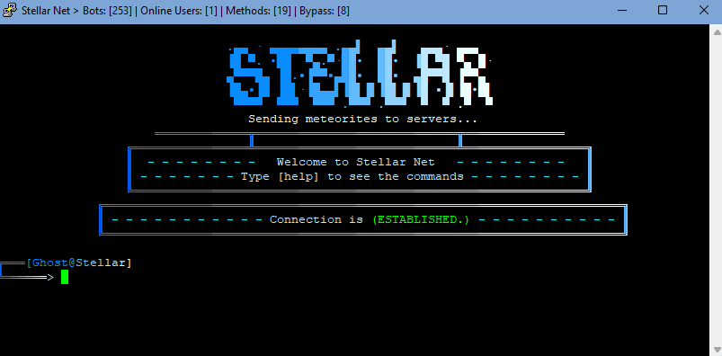

# 🚀 Stellar: New Age v3 - Free DDoS Panel 🚀
> Your terminal has to accept ANSI colors so that the colors can be seen<br>

# Tree
* [Announcements for V4](#V4-preview)
* [Read this Pls](#plz-%EF%B8%8F)
* [Stellar Info](stellar-info)
* [Setup](#Setup)
* [Credits](#Credits)
* [T.O.S](#TOS)

# V4 preview:
The least powerful methods will be removed so that only the most powerful ones remain, as well as more powerful methods for layer 4 and 7 will be added.<br>
1 AMP method and 2 Methods for Games will be added<br>
The entire User Interface (UI) will be changed as well as the prompt and a title will be added<br>
a section will be added where the ports and the rules are shown<br>
ascii art animations will be added<br>
tools will be added (ip lookup, ping, my ip, etc)<br>
a login will be added<br>
the number of proxies will be increased<br>

# Plz ♥️
It would help me a lot if you give a star ⭐ to this repository.<br>
One star from you = more desire to continue updating stellar

# Stellar Info
- [x] Open Source
- [x] Stable
- [x] Simple
- [x] Methods for Layer 4 and 7
- [x] Bypass (CF, OVH, Etc)  



# Setup
```sh
git clone https://github.com/SkyWtkh/Stellar-New-Age
sudo apt-get install python3
sudo apt-get install python2
sudo apt-get install python3-pip
sudo apt-get install npm
sudo apt-get install nodejs
cd Stellar-New-Age
npm i crytpo-random-string
npm i events
npm i fs
npm i net
npm i cloudscraper
npm i request
npm i hcaptcha-solver
npm i randomstring
npm i cluster
npm i cloudflare-bypasser
pip3 install datetime
python3 -m pip3 install -r requirements.txt
ulimit -n 999999
chmod +x *
sudo python3 stellar.py
```

# Credits
```sh
MHProDev
Empfaked
im-federal
R00tS3C
(Methods <3)
Z3NTL3
(Inspiration <3)
```

# TOS:
```sh
Do not attack government pages (.gov/.gob), educational pages (.edu) or the United States Department of Defense (.mil), 
the creator is not responsible for the damage caused by the attacks. 
remember: you are responsible for the attacks since this tool was created for educational purposes
```
